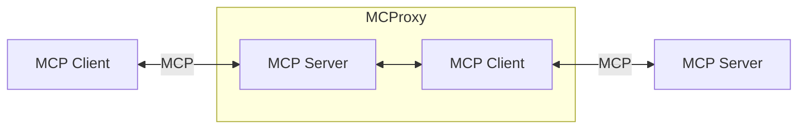
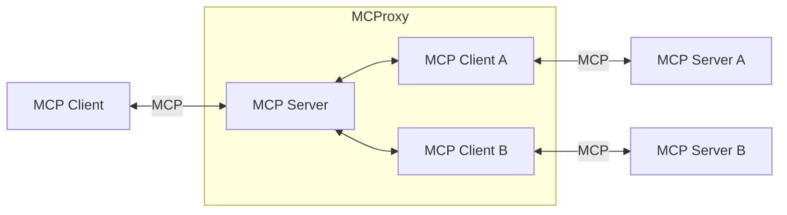
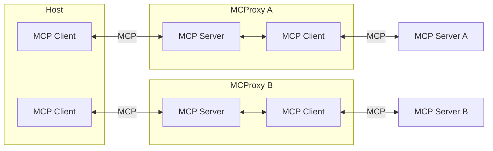
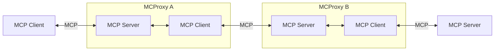
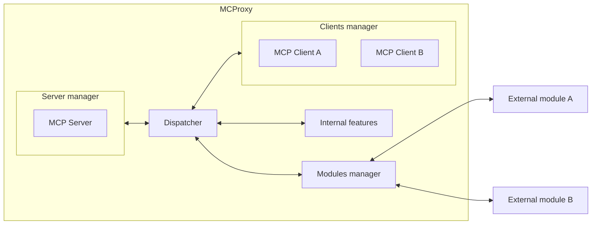

# Foreword

This is very experimental and possibly totally useless 😁. Join [this discussion](https://github.com/LaurentAjdnik/mcproxy/discussions/2) for feedback, that will be greatly appreciated.

Note: This might contradict [this](https://spec.modelcontextprotocol.io/specification/architecture/#design-principles): "Cross-server interactions are controlled by the host". Or not...

# Overview

This project is related to Anthropic's Model Context Protocol (MCP, see [docs](https://modelcontextprotocol.io) and [spec](https://spec.modelcontextprotocol.io/)).

MCProxy is a proxy between MCP Clients and MCP Servers, allowing new features in the workflow between them (a few [examples](#features) are given below).

MCProxy provides the building blocks for such a proxy architecture, along with some basic features (TBD: List of basic features).

New features can be added, depending on the user's needs, with plug-in modules (TBD: Plug-in mechanism).

# Global architecture

From an MCP Client's perspective, MCProxy behaves like an MCP Server. From an MCP Server's perspective, MCProxy behaves like an MCP Client.

In its simplest form:

An MCProxy can connect to multiple servers:

An MCP Host may connect to different MCProxies with very different configurations:

If of any use, MCProxies can be chained:

# Internal architecture

The basic components are:
- The **Server manager**, that handles the communication with the MCP Client (Requests but also Responses/Errors/Notifications)
- The **Clients manager**, that maintains a list of connected MCP Servers and handles the communication with them (Requests but also Responses/Errors/Notifications)

The **Internal features** component provides a list of basic features that are always available.

The **Modules manager** maintains a list of external modules, which provide extra-features, and interacts with them.

The core component is the **Dispatcher**, that:
- Forwards messages between the MCP Client and the MCP Servers, back and forth
- Applies the internal features, when applicable
- Calls the external modules, when applicable

# Identifiers

By default, MCProxy exposes all the resources/prompts/tools of the MCP Servers it connects to, using the same identifiers (names, URIs...). These identifiers can be renamed (see Features below).

# Configuration

In order to connect to MCP Servers, MCProxy uses the same configuration file format as defined in the [Quickstart section](https://modelcontextprotocol.io/quickstart#installation) of the MCP docs.

Some more internal configuration is available for the MCProxy itself.

Finally, each module provides some configuration directives. Examples are given below.

Note: In MCP Hosts, like Claude Dekstop, the configuration file would point towards the MCProxy, not the different servers behind it.

# Features

Here are a few examples of features an MCProxy could implement, internally of through external modules.

## Logging

An MCProxy can log all messages going back and forth between an MCP Client and an MCP Server.

Configuration:
- What to log
- Where to log

## Capabilities aggregation

An MCProxy can aggregate capabilities from different MCP Servers into a meaningful package.

## Capabilities blocking

An MCProxy may expose only a subset of the capabilities provided by the MCP Server(s) it connects to.

Configuration:
- Capabilities to be blocked
 
## Capabilities disambiguation

With the fast-growing number of MCP Servers, me might end up with some name collisions. An MCProxy may rename capabilities, so that they appear unique to an MCP Client, and handle routing to the appropriate MCP Server.

Configuration:
- List of Server / Identifier => New identifier

## Content update

Textual content can be filtered or enriched while going through MCProxy.

## On-the-fly internationalization (i18n)

The current version of the MCP Specification does not provide i18n (see [my issue about this](https://github.com/modelcontextprotocol/specification/issues/86)).

An MCProxy could translate some fields on the fly, using a translation API or an LLM.

Configuration:
- Preferred language
- Connection parameters to the translation tool
 
# External modules

They provide extra-features on top of the basic features provided by MCProxy itself.

They are independent projects that plug into an MCProxy.

A list of such modules could be maintained, just like lists of MCP Clients/Servers are currently being built (see for instance [here](https://github.com/modelcontextprotocol/servers), [here](https://github.com/punkpeye/awesome-mcp-servers) or [here](https://github.com/wong2/awesome-mcp-servers)).

## Hosting

They can be hosted locally or remotely as a service.

## Capabilities

They declare their "capabilities", that it the types of MCP messages they are interested in.

They are called in the order in which they are declared in the configuration file.

## Protocol

The protocol between MCProxy and an external module is strongly inspired by the MCP specification.

But the workflow is quite different: Mostly, a response usually has the same type as the message sent.

For instance:
- a `GetPromptRequest` message sent to a module would return an updated `GetPromptRequest` message
- a `ListToolsResult` message sent to a module would return an updated `ListToolsResult` message

(TBD: Specification of such a protocol)
