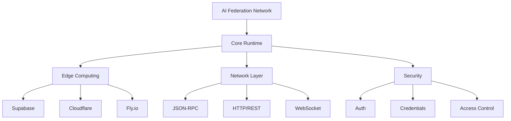

# AI Federation Network

A distributed runtime system for federated AI services with edge computing capabilities.

# Complete implementation following the official MCP specification:

The Model Context Protocol (MCP) enables federated connections between AI systems and various data sources through a standardized architecture. Here’s a complete implementation following the official specification:

This implementation provides a foundation for building federated MCP systems that can scale across multiple servers while maintaining the protocol’s security and standardization requirements. The federation layer enables seamless communication between different MCP servers, allowing AI systems to maintain context while moving between different tools and datasets.

The implementation supports both local and remote connections through multiple transport mechanisms, including stdio for local process communication and HTTP with Server-Sent Events for remote connections. 

Security is maintained through strict capability negotiation and user consent requirement

Model Context Protocol (MCP) with Federation Support

## Key Benefits

**Simplified Integration**:
- Eliminates custom connections for each data source
- Standardizes AI connections with enterprise tools
- Maintains context across federated tools and datasets

## Federation Architecture

**Core Components**:
- Federation Controller: Manages cross-server communication
- Proxy Layer: Handles authentication between federated servers
- Identity Management: Controls access across federated instances

## Basic Structure

**System Components**:
- MCP Hosts: AI applications needing federated data access
- MCP Servers: Programs providing federated resource access
- MCP Clients: Components maintaining federated connections
- Federation Proxy: Manages cross-server authentication
 
## Real-World Applications

**Implementation Areas**:
- Development tools with federated code repositories
- Enterprise systems with distributed databases
- Cross-organizational content repositories
- Multi-region business tool integration

## Security Features

**Protection Mechanisms**:
- Federated authentication and authorization
- Cross-server resource isolation
- Distributed consent management
- Encrypted cross-server communication
- Granular capability control

MCP with federation support enables secure, standardized AI system integration across organizational boundaries while maintaining strict security controls and seamless data access.

# Deno Nodejs version 
complete implementation using both Deno and Node.js. Let's start with the project structure:


### 🌐 Network Protocols
- JSON-RPC 2.0
- HTTP/REST
- WebSocket

### ⚡ Edge Computing
- Multi-provider support (Supabase, Cloudflare Workers, Fly.io)
- Serverless function deployment
- Real-time logs and monitoring
- Auto-scaling capabilities

### 🔐 Security
- Provider-specific authentication
- Secure credential storage
- Environment isolation
- Access control

### 📡 Runtime Features
- Task execution
- Federation support
- Intent detection
- Meeting information processing
- Webhook handling
- Real-time status monitoring
- System health checks

## System Architecture



## Getting Started

```bash
# Run the server
deno run --allow-net --allow-env --allow-read --allow-write --allow-run src/apps/deno/server.ts
```

## License

MIT License - See LICENSE file for details.